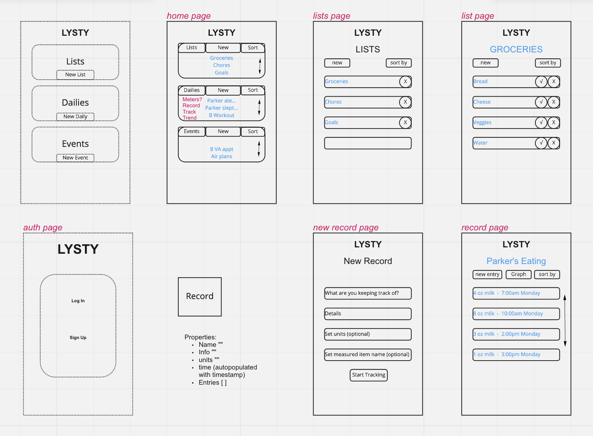

# Listy

This React app allows you to create and collaborate lists, logs, and events.

## Why?

I needed a solution to not knowing how much milk our son has had today when my partner asks and keeping track of little paper lists for groceries and chores.

While I'm at that, seeing a history of milk per day compared to one of sleep sounds quite useful.

## Design

Guiding principles in design of UI and API:

- Flexible - must be accommodating to a range of listing, logging, and planning purposes. (not just for milk and groceries)
- Simple - minimize clicks to create an entry, reduce form elements footprint and displacement when editing.

## Tools & Tech

Frontend:

- React.js with reactn for global state.
- Chart.js and React-Chartjs-2 for visualizing logs.
- React-Calendar for visualizing events.
- Axios making API calls.

Backend:

- Node.js and Express for serving the database
- MongoDB storing data
- Mongoose for data modeling
